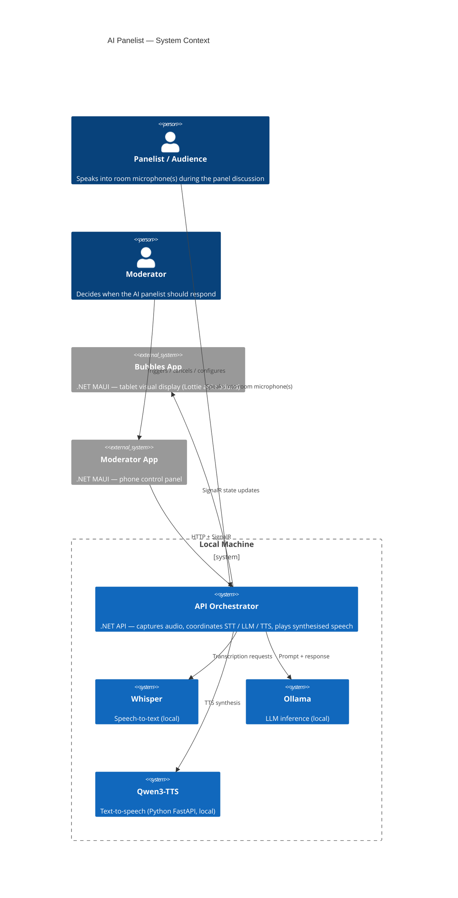
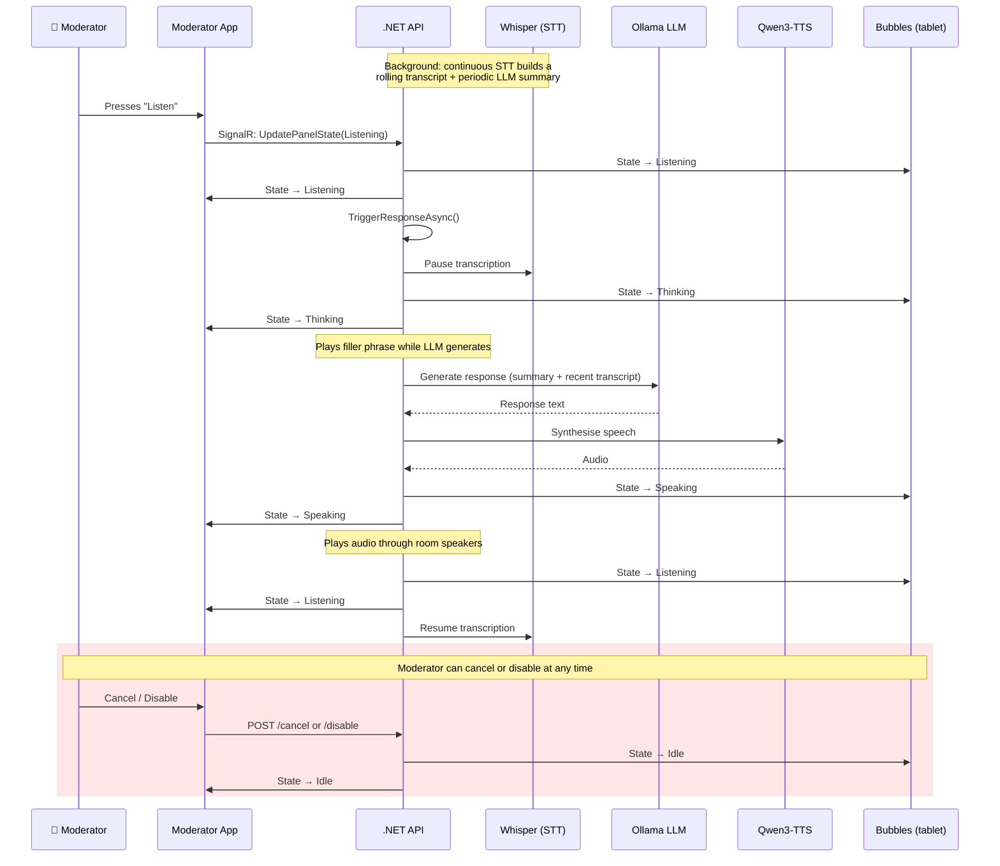

# Architecture Diagrams

These diagrams describe the AI Panelist system using the [C4 model](https://c4model.com/), rendered with [Mermaid's C4 extensions](https://mermaid.js.org/syntax/c4.html).

Everything runs on a single local machine, except two .NET MAUI client apps — **Bubbles** (tablet visual display) and the **Moderator App** (phone control panel) — which connect over the local network via SignalR and HTTP.

Audio capture and playback both happen server-side: room microphones pick up the human panelists, and the AI's synthesised speech plays through the room's speakers. No audio passes through the client apps.

There is no voice activity detection. A human moderator decides when the AI should respond by pressing **Listen** in the Moderator App, which triggers the full pipeline: STT transcript + summary → LLM response → TTS → audio playback. Speech-to-text runs continuously in the background to maintain a rolling transcript and periodic summary, so context is always available when a response is triggered.

## System Context (C4 Level 1)

## Pipeline Flow

The sequence below shows how a single response is produced. Note that STT runs continuously in the background — the trigger from the moderator initiates LLM generation using the transcript already accumulated.

